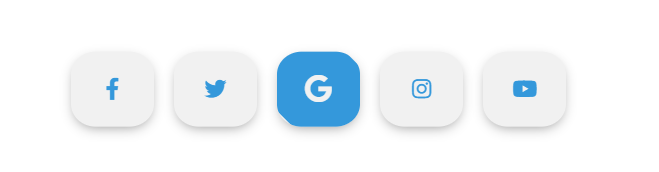

# CSS Tutorial

## Cool Menu Hover Effect Tutorial

【youtube】 https://www.youtube.com/watch?v=Cx5TSXXaR9A&list=PL5e68lK9hEzfe1nPJ2aB5A7jmwgRuTZOm&index=1

## customWarningAlertNotification

[youtube] https://www.youtube.com/watch?v=hm79I2JpwJw

## gridLayoutCrashCourse

### [描述]:gird 布局

[youtube] https://www.youtube.com/watch?v=jV8B24rSN5o

[参考资料]: https://www.ruanyifeng.com/blog/2019/03/grid-layout-tutorial.html

## Working Analog Clock using HTML CSS & Javascript | Neumorphsim UI Design

[描述]：钟

[youtube]https://www.youtube.com/watch?v=NVoIEEb0Hqg&t=10s

## Cool CSS Menu Hover Effects - Html5 Css3 Hover Effect Tutorial

[描述]：span:beafore span:after ，opacity 0 透明度变化，transition

【youtube】https://www.youtube.com/watch?v=lJX-MlO_1GE

## Working Digital Clock using HTML CSS & Javascript | Neumorphism UI Design

[描述]：简单时钟显示

【youtube】https://www.youtube.com/watch?v=CP2V4tN8kYI&t=3s

## CSS Position Sticky Scrolling Effects | No Javascript

[描述]：position : sticky 的使用

【youtube】https://www.youtube.com/watch?v=7ThSiVinrmU

## CSS Glowing Loading Page Animation Effects

[描述]: css text-shadow

【youtube】https://www.youtube.com/watch?v=EkNfXFYPBR4&t=132s

## Creative Page Scroll Progress Bar

[描述]: scroll 样式 filter blur 等

【youtube】https://www.youtube.com/watch?v=qYFkQa0Bbq0

## Simple Text Animation

[描述]: 字体位置变化，transform: translateX(-200px) translateY(-200px);

【youtube】https://www.youtube.com/watch?v=Xv2dE5oWMNY&t=60s

## How to create the Responsive Side Navigation Bar Using HTML CSS and Jquery | Vertical Navbar

[描述]：

【youtube】https://www.youtube.com/watch?v=Ihwqun_HmXs

## Responsive Personal Portfolio Website

[描述]：响应式网站，aos 动画，返回 top，右上角 menu 动画,字体引入

【youtube】https://www.youtube.com/watch?v=T7PnWnTgusc
[github]:https://github.com/adaorachi/rosie_ellis

## CSS3 Cloud Banner Animation Effects | Pure CSS Animated Clouds

[描述]：云飞翔效果，animate，translateY ，css calc

【youtube】https://www.youtube.com/watch?v=FWW38GuIo7M&t=18s

## Shape Outside Circle

[描述]：文字环绕图片，shape-outside: circle();

【youtube】

## Angled Div Shape

[描述]：Div 梯形 ，box-sizing chrome 不支持;

【youtube】 https://www.youtube.com/watch?v=A11xEtSNDr8

chorme 不支持？

## Scroll to top button

[描述]：通过 position:fixed 实现返回顶部功能

【youtube】 https://www.youtube.com/watch?v=HP3ZSd3ko5Y

## Cool Hover Animation on Social Media Icons | HTML & CSS

[描述]：动画

【youtube】 https://www.youtube.com/watch?v=_fafoYgeX7Y&t=44s

## Floating Action Button using Html CSS & Vanilla Javascript | CSS3 Material Design

[描述]：position:fixed

【youtube】 https://www.youtube.com/watch?v=dsMj8_dUJTQ&t=91s

## Creating an Animated 404 Page using HTML & CSS | Responsive Web Design

[描述]：animate

【youtube】 https://www.youtube.com/watch?v=CGVI_mnnO50&list=WL&index=6&t=0s

## Glowing Text Animation Effects 2 | Html CSS Animation

[描述]：animate

【youtube】 https://www.youtube.com/watch?v=1B3FgFXn274

## CSS Glowing Text Hover Effects | Quick HTML CSS Tutorial For Beginner

[描述]：animate

【youtube】 https://www.youtube.com/watch?v=I_RhD99rR0c

## How To Create An Image Slider In HTML, CSS & Javascript

[描述]：transition transform

【youtube】 https://www.youtube.com/watch?v=KcdBOoK3Pfw&list=WL&index=2&t=0s

## Simple Images Slider Show - Css Animation Tutorial only using html and css

[描述]：animate

【youtube】 https://www.youtube.com/watch?v=fw3fOHnzCjI&list=WL&index=3&t=0s

## Transparent Login Form with HTML & CSS - Login form Design

[描述]：Login Form

【youtube】 https://www.youtube.com/watch?v=ylFLVBbB9AM&t=309s

## Transparent Login Form with floating Placeholder Text - Pure CSS Label Slide Up on Focus - No jQuery

[描述]：Login Form

【youtube】 https://www.youtube.com/watch?v=UJvL4i6UPbY

## Create The Our team Section By Using HTML & CSS

[描述]：:target 伪类 https://developer.mozilla.org/zh-CN/docs/Web/CSS/:target

【youtube】 https://www.youtube.com/watch?v=DNiGz7Zxk2Y&t=42s

## Scrolling Effect For Website Header Using HTML CSS - Learn Website UI Design

[描述]：
background: linear-gradient(rgba(255, 255, 255, 0.565), rgba(255, 255, 255, 0.565)), url(../assets/images/carousel4.jpg) no-repeat;

window.onscroll = function () {}

**注意：** 浏览器 devtool 是中 network 下关闭 Disable catch

【youtube】 https://www.youtube.com/watch?v=7iqRppSPexU&t=36s

## Animated share button with icon Html and Css (Animated)

## 动画分享按钮

[描述]：动画按钮分享

【youtube】 https://www.youtube.com/watch?v=bm11uUrCrw8

## Social media buttons with amazing animation on hover using html & css

[描述]：animated

【youtube】 https://www.youtube.com/watch?v=fDm0WJ_66d0&t=29s

## Splash Image Mask using Html CSS | Quick CSS Tips & Tricks

[描述]： mix-blend-mode: screen;

【youtube】 https://www.youtube.com/watch?v=lBK_kh4iCAQ&list=WL&index=2&t=0s

## How to make Sidebar Popup Effect using HTML CSS JS

[描述]： width: calc(100% - 60px); margin-left: 60px;

【youtube】 https://www.youtube.com/watch?v=kMFvIH2xgqI&list=WL

## CSS3 Glowing Apple Logo Animation Effects | Qucik CSS Animation Tutorial For Beginners

[描述]： animate

【youtube】 https://www.youtube.com/watch?v=ZyNzmOEJ48A&list=WL&index=4&t=0s

https://www.youtube.com/watch?v=a-4astkESO0&list=WL&index=3&t=98s

## Animate On Scroll using HTML CSS JS - Animate website section while scrolling

[描述]： jquery smoove

【youtube】 https://www.youtube.com/watch?v=ZyNzmOEJ48A&list=WL&index=4&t=0s

## How To Make Video Gallery In HTML And CSS Website Step By Step Tutorial

[描述]： img 的 border-radius 外面必须包裹一层div,div和img都设置border-radius才有效

【youtube】 https://www.youtube.com/watch?v=wnseY8goQoc&t=718s

## Single Element CSS iPhone Box Mockup | iPhone 12 Box Mockup using Html CSS Only

[描述]: 

【youtube】 https://www.youtube.com/watch?v=4o_AzewcyQY

