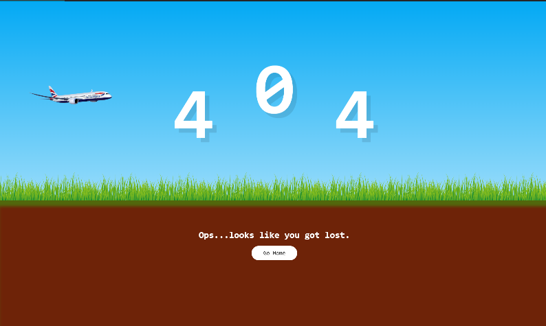
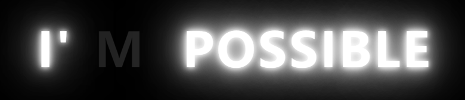
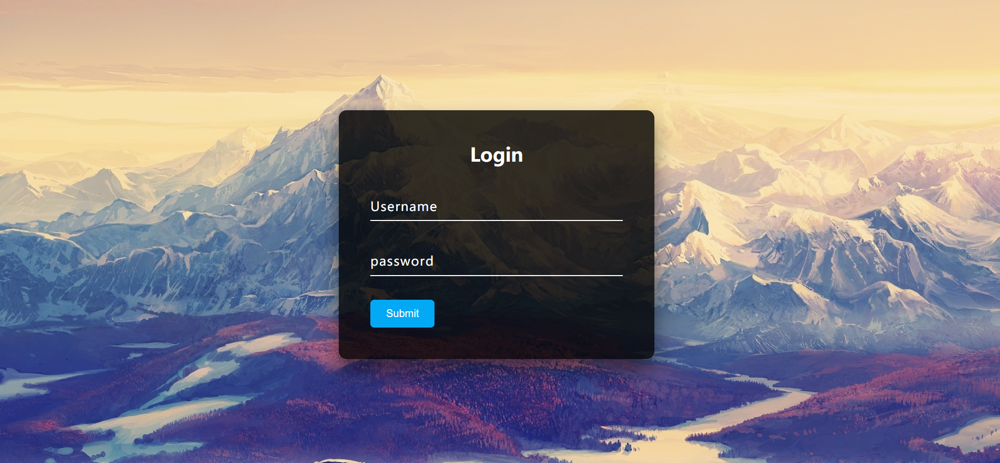
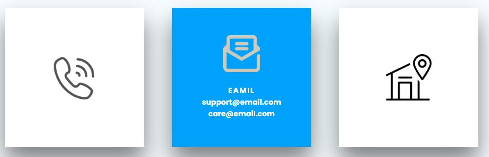

# CSS Tutorial

## Cool Menu Hover Effect Tutorial

【youtube】 https://www.youtube.com/watch?v=Cx5TSXXaR9A&list=PL5e68lK9hEzfe1nPJ2aB5A7jmwgRuTZOm&index=1

## customWarningAlertNotification

[youtube] https://www.youtube.com/watch?v=hm79I2JpwJw

## gridLayoutCrashCourse

### [描述]:gird 布局

[youtube] https://www.youtube.com/watch?v=jV8B24rSN5o

[参考资料]: https://www.ruanyifeng.com/blog/2019/03/grid-layout-tutorial.html

## Working Analog Clock using HTML CSS & Javascript | Neumorphsim UI Design

[描述]：钟

[youtube]https://www.youtube.com/watch?v=NVoIEEb0Hqg&t=10s

## Cool CSS Menu Hover Effects - Html5 Css3 Hover Effect Tutorial

[描述]：span:beafore span:after ，opacity 0 透明度变化，transition

【youtube】https://www.youtube.com/watch?v=lJX-MlO_1GE

## Working Digital Clock using HTML CSS & Javascript | Neumorphism UI Design

[描述]：简单时钟显示

【youtube】https://www.youtube.com/watch?v=CP2V4tN8kYI&t=3s

## CSS Position Sticky Scrolling Effects | No Javascript

[描述]：position : sticky 的使用

【youtube】https://www.youtube.com/watch?v=7ThSiVinrmU

## CSS Glowing Loading Page Animation Effects

[描述]: css text-shadow

【youtube】https://www.youtube.com/watch?v=EkNfXFYPBR4&t=132s

## Creative Page Scroll Progress Bar

[描述]: scroll 样式 filter blur 等

【youtube】https://www.youtube.com/watch?v=qYFkQa0Bbq0

## Simple Text Animation

[描述]: 字体位置变化，transform: translateX(-200px) translateY(-200px);

【youtube】https://www.youtube.com/watch?v=Xv2dE5oWMNY&t=60s

## How to create the Responsive Side Navigation Bar Using HTML CSS and Jquery | Vertical Navbar

[描述]：

【youtube】https://www.youtube.com/watch?v=Ihwqun_HmXs

## Responsive Personal Portfolio Website

[描述]：响应式网站，aos 动画，返回 top，右上角 menu 动画,字体引入

【youtube】https://www.youtube.com/watch?v=T7PnWnTgusc
[github]:https://github.com/adaorachi/rosie_ellis

## CSS3 Cloud Banner Animation Effects | Pure CSS Animated Clouds

[描述]：云飞翔效果，animate，translateY ，css calc

【youtube】https://www.youtube.com/watch?v=FWW38GuIo7M&t=18s

## Shape Outside Circle

[描述]：文字环绕图片，shape-outside: circle();

【youtube】

## Angled Div Shape

[描述]：Div 梯形 ，box-sizing chrome 不支持;

【youtube】 https://www.youtube.com/watch?v=A11xEtSNDr8

chorme 不支持？

## Scroll to top button

[描述]：通过 position:fixed 实现返回顶部功能

【youtube】 https://www.youtube.com/watch?v=HP3ZSd3ko5Y

## Cool Hover Animation on Social Media Icons | HTML & CSS

[描述]：动画

【youtube】 https://www.youtube.com/watch?v=_fafoYgeX7Y&t=44s

## Floating Action Button using Html CSS & Vanilla Javascript | CSS3 Material Design

[描述]：position:fixed

【youtube】 https://www.youtube.com/watch?v=dsMj8_dUJTQ&t=91s

## Creating an Animated 404 Page using HTML & CSS | Responsive Web Design

[描述]：animate

【youtube】 https://www.youtube.com/watch?v=CGVI_mnnO50&list=WL&index=6&t=0s

## Glowing Text Animation Effects 2 | Html CSS Animation

[描述]：animate

【youtube】 https://www.youtube.com/watch?v=1B3FgFXn274

## CSS Glowing Text Hover Effects | Quick HTML CSS Tutorial For Beginner

[描述]：animate

【youtube】 https://www.youtube.com/watch?v=I_RhD99rR0c

## How To Create An Image Slider In HTML, CSS & Javascript

[描述]：transition transform

【youtube】 https://www.youtube.com/watch?v=KcdBOoK3Pfw&list=WL&index=2&t=0s

## Simple Images Slider Show - Css Animation Tutorial only using html and css

[描述]：animate

【youtube】 https://www.youtube.com/watch?v=fw3fOHnzCjI&list=WL&index=3&t=0s

## Transparent Login Form with HTML & CSS - Login form Design

[描述]：Login Form

【youtube】 https://www.youtube.com/watch?v=ylFLVBbB9AM&t=309s

## Transparent Login Form with floating Placeholder Text - Pure CSS Label Slide Up on Focus - No jQuery

[描述]：Login Form

【youtube】 https://www.youtube.com/watch?v=UJvL4i6UPbY

## Create The Our team Section By Using HTML & CSS

[描述]：:target 伪类 https://developer.mozilla.org/zh-CN/docs/Web/CSS/:target

【youtube】 https://www.youtube.com/watch?v=DNiGz7Zxk2Y&t=42s

## Scrolling Effect For Website Header Using HTML CSS - Learn Website UI Design

[描述]：
background: linear-gradient(rgba(255, 255, 255, 0.565), rgba(255, 255, 255, 0.565)), url(../assets/images/carousel4.jpg) no-repeat;

window.onscroll = function () {}

**注意：** 浏览器 devtool 是中 network 下关闭 Disable catch

【youtube】 https://www.youtube.com/watch?v=7iqRppSPexU&t=36s

## Animated share button with icon Html and Css (Animated)

## 动画分享按钮

[描述]：动画按钮分享

【youtube】 https://www.youtube.com/watch?v=bm11uUrCrw8

## Social media buttons with amazing animation on hover using html & css

[描述]：animated

【youtube】 https://www.youtube.com/watch?v=fDm0WJ_66d0&t=29s

## Splash Image Mask using Html CSS | Quick CSS Tips & Tricks

[描述]： mix-blend-mode: screen;

【youtube】 https://www.youtube.com/watch?v=lBK_kh4iCAQ&list=WL&index=2&t=0s

## How to make Sidebar Popup Effect using HTML CSS JS

[描述]： width: calc(100% - 60px); margin-left: 60px;

【youtube】 https://www.youtube.com/watch?v=kMFvIH2xgqI&list=WL

## CSS3 Glowing Apple Logo Animation Effects | Qucik CSS Animation Tutorial For Beginners

[描述]： animate

【youtube】 https://www.youtube.com/watch?v=ZyNzmOEJ48A&list=WL&index=4&t=0s

https://www.youtube.com/watch?v=a-4astkESO0&list=WL&index=3&t=98s

## Animate On Scroll using HTML CSS JS - Animate website section while scrolling

[描述]： jquery smoove

【youtube】 https://www.youtube.com/watch?v=ZyNzmOEJ48A&list=WL&index=4&t=0s

## How To Make Video Gallery In HTML And CSS Website Step By Step Tutorial

[描述]： img 的 border-radius 外面必须包裹一层div,div和img都设置border-radius才有效

【youtube】 https://www.youtube.com/watch?v=wnseY8goQoc&t=718s

## Single Element CSS iPhone Box Mockup | iPhone 12 Box Mockup using Html CSS Only

[描述]: 
.iPhone::after {
  content: '';
  position: absolute;
  bottom: -82px;
  left: 0px;
  width: 100%;
  height: 82px;
  background: url(../assets/images/samsung.png) #f2f2f2;
  background-position: center;
  background-repeat: no-repeat;
  background-size: 96px;
  transform-origin: top;
  transform: skewX(-47deg);
}

【youtube】 https://www.youtube.com/watch?v=4o_AzewcyQY

## Contact Info Box Hover Effects using Html & CSS Only

【youtube】 https://www.youtube.com/watch?v=fs-kz0aCraE&list=WL&index=1&t=75s
[描述]： 
  effect1:
    transform: scale(0);
    transition: 0.5s;
    transition-delay: 0.5s; 

[描述]： 
  effect2:
    transition: 0.5s;
    transition-delay: 0.5s; 
    transform: scale(1) translateY(calc(100% - 5px))

    box里面设置css：overflow: hidden;

## How to create animated Pie-chart or Skills bar in HTML CSS JQuery Web Design

[描述]： easy-pie-chart  有angularjs 版本，但不支持带小数点的数据

【youtube】 https://www.youtube.com/watch?v=oi92MBMqdt0

## How to Create Responsive Tab Menu using HTML CSS JQuery - Learn Web Design

[描述]： jquery responsive-tabs 

【youtube】 https://www.youtube.com/watch?v=W_BgsepKx6U&list=WL&index=3&t=24s

## Our Services Box Hover Effects | Html CSS Responsive Design

[描述]： pointer-events: none; none值能阻止点击、状态变化和鼠标指针变化
	overflow:hidden 后， box-shadow: 0 0 0 400px #e91e63; 展现动画效果

【youtube】 https://www.youtube.com/watch?v=JJkuGvfFKOw&list=WL&index=2&t=64s

## 3D Book Mockup Using CSS | CSS3 Isometric Design

[描述]：   transform: skewY(-45deg) translate(-30px, -15px);
  box-shadow: inset -10px 0 20px rgba(0, 0, 0, 0.2);
字体透明
.book h2 span {
  background:url(/assets/images/bg.jpg);
  background-attachment: fixed;
  -webkit-background-clip: text;
  -webkit-text-fill-color: transparent;
}

【youtube】 https://www.youtube.com/watch?v=Za7PiYZlc4I

## Creative Hover Effect and Popup with HTML CSS JS

[描述]： 
  1. position fixed 模态对话框，background: rgba(71, 69, 69, 0.7); 背景
  2.   background-color: rgba(37, 37, 38, 0.91);
  height: 100%;
  transform: translateY(101%);
  transition: all 0.3s ease-in-out;
  hover后
   transform: translateY(0%);

【youtube】 https://www.youtube.com/watch?v=bVaKJW_vxU4&list=WL&index=2

## Pure CSS Creative Hover Effect in Website Design Tutorial Latest css hover effect

[描述]：
transform:perspective(150px) scaleX(0);
  transition: transform 0.5s ease, opacity 0.5s ease;
background-image: linear-gradient(90deg, deepskyblue 0%, hotpink 100%);

【youtube】 https://www.youtube.com/watch?v=si7tvyDv4mc&list=WL&index=2

## CSS Text Transition Hover Effects | Html CSS

[描述]：
transform-origin: right;
transform: scaleX(1);

h1:hover span hide {
  transition-delay: 1s;
  color: #f00;
  opacity: 0;
}

【youtube】 https://www.youtube.com/watch?v=QRQHivXy75k&list=WL&index=1

## Quickly and Easily Create Custom Scrollbars that Look Awesome

[描述]：
simplebar.js

[youtube] https://www.youtube.com/watch?v=74eaw_nM5tY&list=WL&index=3

 

<!-- TODO -->
## How To Make Drop Down Menu

[youtube] https://www.youtube.com/watch?v=wHFflWvii3M&list=WL&index=1

## Sidebar Menu

[youtube] https://www.youtube.com/watch?v=P_A2kNpyQBs&list=WL&index=4&t=748s

## CSS loading 
[youtube] https://www.youtube.com/watch?v=1Aq9OJuS3ok&list=WL&index=2

## Pure CSS Button Hover animation effect css and svg
[youtube] https://youtu.be/1__4ldTj9hE

## How to make very simple and sweetest Timeline Design for website in HTML CSS - CSS Animation Effect
[youtube] https://www.youtube.com/watch?v=zNy3dmgRhOM

## Latest Parallax Scroll using HTML CSS JS - Parallax and Scroll
[youtube] https://www.youtube.com/watch?v=RK5Fn-L6Gds&list=WL&index=11
